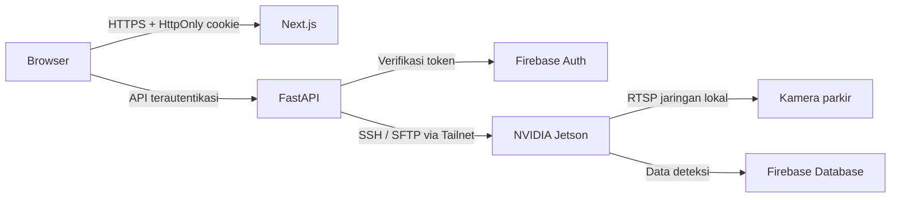

<p align="center">
  
</p>

<h1 align="center">BRIN Edge Computing</h1>

<p align="center">
  Website internal untuk memantau NVIDIA Jetson, melihat kamera parkir, dan menjalankan deteksi kendaraan tanpa harus SSH.
</p>

<p align="center">
  
  
  
  
</p>

---

## Apa yang dapat dilakukan?

- **Berkas workspace** — menelusuri direktori Jetson melalui SFTP dan membuka berkas teks dalam mode hanya-baca.
- **Kondisi perangkat nyata** — menampilkan GPU, suhu, memori, penyimpanan, uptime, status kamera, dan latensi.
- **Gambar dan Real-Time Cam** — frame kamera berkala serta MJPEG channel HD dalam tampilan penuh.
- **Deteksi kendaraan** — menjalankan hanya script `Test*.py` dan `Tset*.py` yang masuk allowlist, lalu menampilkan anotasinya.
- **Firebase Authentication** — sesi HttpOnly yang dapat diperbarui dan tetap aktif setelah browser ditutup.
- **Petunjuk pengguna baru** — tur tiga langkah yang tersimpan secara lokal pada setiap browser.

## Arsitektur aman



Browser tidak pernah menerima SSH key, kredensial kamera, URL RTSP, service-account Firebase, atau akses shell bebas. Semua operasi sensitif berada di FastAPI dan dibatasi ke workspace Jetson yang dikonfigurasi.

## Struktur proyek

```text
apps/
├── api/                    # FastAPI, Firebase session, SSH/SFTP, kamera, deteksi
│   ├── app/
│   └── tests/
└── web/                    # Next.js UI, petunjuk, unit test, Playwright E2E
    ├── e2e/
    ├── public/
    └── src/
```

## Menjalankan di lokal

### 1. Tools

- Node.js 20+
- Python 3.11+
- Akses Tailnet menuju Jetson
- SSH private key khusus backend
- Firebase project dengan provider **Email/Password** aktif

### 2. Backend

```powershell
cd apps/api
python -m venv .venv
.venv\Scripts\python.exe -m pip install -r requirements.txt
Copy-Item .env.example .env
```

Isi `apps/api/.env` dengan alamat Jetson, lokasi key, Firebase Web API key, project ID, dan email operator. Jangan commit file `.env` atau private key.

```powershell
.venv\Scripts\python.exe -m uvicorn app.main:app --reload --port 8000
```

### 3. Frontend

```powershell
cd apps/web
npm ci
Copy-Item .env.example .env.local
npm run dev
```

Buka [http://localhost:3000](http://localhost:3000).

## Variabel penting

| Variabel | Keterangan |
|---|---|
| `JETSON_HOST` | IP Tailnet Jetson |
| `JETSON_PRIVATE_KEY` | Path private key backend |
| `JETSON_KNOWN_HOSTS` | Path `known_hosts` yang dipin |
| `JETSON_WORKSPACE` | Satu-satunya root workspace yang boleh dibaca |
| `FIREBASE_WEB_API_KEY` | Web API key Firebase Authentication |
| `FIREBASE_PROJECT_ID` | Firebase project ID |
| `FIREBASE_ADMIN_EMAIL` | Email Firebase yang dipetakan ke username operator |
| `AUTH_COOKIE_SECURE` | Wajib `true` saat menggunakan HTTPS produksi |
| `CAMERA_MAX_LIVE_VIEWERS` | Batas stream MJPEG bersamaan; default `4` |
| `NEXT_PUBLIC_API_URL` | URL FastAPI yang diakses browser |

Lihat `.env.example` pada masing-masing aplikasi untuk daftar lengkap.

## Pengujian

```powershell
# Backend
cd apps/api
.venv\Scripts\python.exe -m pytest -q

# Frontend
cd apps/web
npm run lint
npm run typecheck
npm test
npm run build

# E2E terautentikasi (password hanya diberikan saat menjalankan test)
$env:BRIN_E2E_PASSWORD="<temporary-test-password>"
npm run test:e2e
Remove-Item Env:BRIN_E2E_PASSWORD
```

## Keamanan Website

Kontrol yang sudah tersedia meliputi:

- Firebase token verification dan cookie `HttpOnly`, `SameSite=Strict`.
- Rate limit percobaan login gagal.
- CORS origin terbatas dan security headers/CSP.
- Path traversal, symlink, jenis file, ukuran file, model, credential, serta secret filtering.
- Allowlist script deteksi dan satu proses deteksi pada satu waktu.
- Known-host verification untuk mencegah SSH man-in-the-middle.
- Snapshot cache, health cache, dan directory cache untuk mengurangi beban ketika banyak pengguna membuka dashboard.

Satu akun Firebase dapat memiliki banyak sesi browser secara bersamaan. Sekitar 20 pengguna dapat membuka dashboard dan operasi baca bersamaan, tetapi pipeline MJPEG 1080p bukan sistem broadcast: default-nya dibatasi ke **4 penonton Real-Time Cam** sekaligus untuk melindungi Jetson. Gunakan WebRTC/media server jika semua pengguna harus menonton video langsung secara bersamaan.

### Checklist produksi

- Gunakan HTTPS dan set `AUTH_COOKIE_SECURE=true`.
- Jalankan Next.js/FastAPI di server yang selalu aktif dalam Tailnet.
- Letakkan reverse proxy dengan batas ukuran request dan connection timeout.
- Ganti password awal dan idealnya gunakan akun individual untuk audit per pengguna.
- Batasi Firebase API key pada API yang diperlukan di Google Cloud Console.
- Jangan expose port FastAPI, SSH, atau kamera ke internet publik.
- Jalankan dependency audit dan backup Firebase secara berkala.

---

<p align="center"><strong>Badan Riset dan Inovasi Nasional</strong><br />Internal edge research workspace</p>
