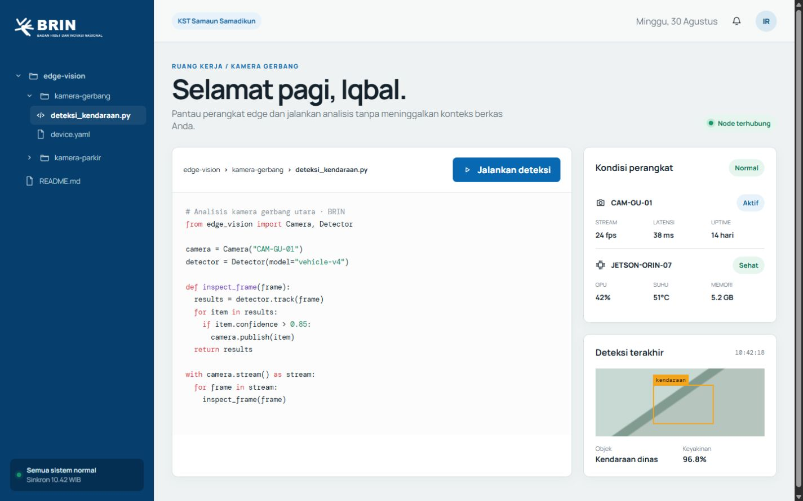
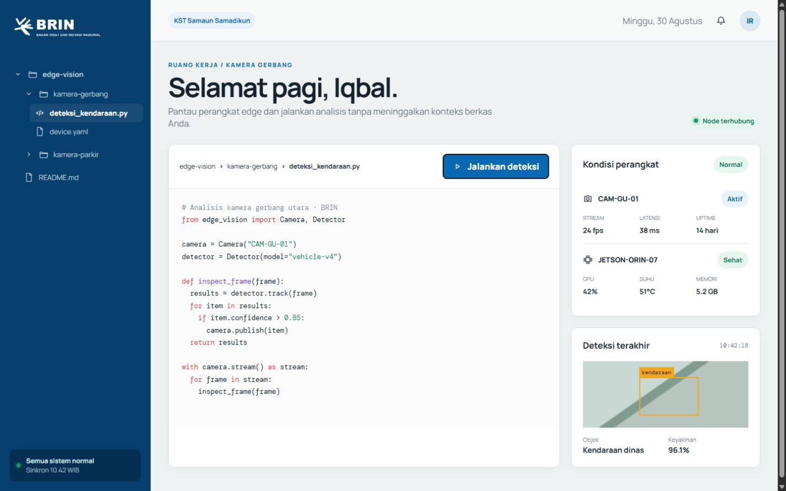
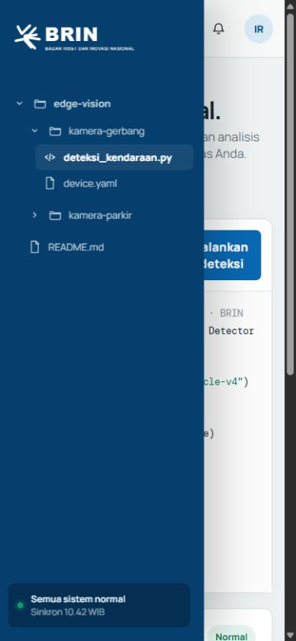

# BRIN Edge Workspace — Research Desk

Status: **Selected design direction**  
Prototype: [`concept-desk.html`](./concept-desk.html)  
Language: Bahasa Indonesia  
Primary users: pegawai BRIN yang memantau kamera dan perangkat edge, termasuk pengguna non-teknis



## 1. Ringkasan

Research Desk adalah antarmuka web untuk mengakses alur kerja perangkat edge melalui pola yang terasa seperti SSH—folder, file konfigurasi, script, dan status perangkat—tanpa memaksa semua pegawai memahami command line.

Desain menggunakan tata letak yang terang, tenang, dan berorientasi tugas. Identitas BRIN hadir melalui warna biru institusional, aksen merah-oranye, logo, dan karakter visual yang menyerupai ruang kerja riset, bukan dashboard generik atau terminal bergaya “hacker”.

## 2. Tujuan produk

1. Memudahkan pegawai menemukan dan membuka folder atau file yang relevan.
2. Menjalankan script deteksi dengan satu aksi yang jelas.
3. Menampilkan kondisi kamera dan Jetson tanpa istilah teknis berlebihan.
4. Mempertahankan konteks teknis agar tim IT tetap dapat melakukan audit dan troubleshooting.
5. Mengurangi risiko salah operasi melalui status, label, dan feedback yang eksplisit.

## 3. Prinsip desain

### Jelas sebelum canggih

Tindakan utama memakai bahasa langsung seperti **Jalankan deteksi**, sedangkan detail teknis ditempatkan sebagai informasi pendukung.

### Terasa seperti file workspace

Folder tree menjadi navigasi utama. Pengguna selalu mengetahui lokasi file melalui breadcrumb dan active state.

### Status harus dapat dipindai

Kondisi perangkat memakai kombinasi label, warna, ikon, dan angka. Warna tidak menjadi satu-satunya pembeda.

### Tenang untuk penggunaan harian

Permukaan terang dan hierarchy yang lapang mengurangi rasa intimidatif yang sering muncul pada aplikasi SSH atau monitoring.

## 4. Arsitektur informasi

```text
BRIN Edge Workspace
├── Lokasi / kawasan
│   └── KST Samaun Samadikun
├── File workspace
│   ├── edge-vision
│   │   ├── kamera-gerbang
│   │   │   ├── deteksi_kendaraan.py
│   │   │   └── device.yaml
│   │   └── kamera-parkir
│   │       └── monitor.py
│   └── README.md
├── Kondisi perangkat
│   ├── Kamera
│   └── Jetson
└── Hasil deteksi terakhir
```

## 5. Struktur layar desktop

| Area | Fungsi | Prioritas |
|---|---|---|
| Sidebar | Membuka folder dan memilih file | Primer |
| Header | Konteks lokasi, notifikasi, dan pengguna | Sekunder |
| Workspace | Membaca file dan menjalankan script | Primer |
| Device health | Membaca kondisi kamera dan Jetson | Primer |
| Detection result | Melihat frame, objek, waktu, dan confidence | Primer |
| Toast | Mengonfirmasi hasil aksi | Sementara |

Desktop memakai sidebar tetap selebar `276px`. Konten utama menggunakan dua kolom: workspace fleksibel dan panel status dengan lebar minimum `285px`.

## 6. Komponen utama

### File tree

- Folder dapat dibuka dan ditutup.
- File aktif memakai latar biru transparan dan teks lebih tebal.
- Jenis file dibedakan melalui ikon file atau code.
- Perpindahan file memperbarui nama pada breadcrumb serta isi workspace.

### Code workspace

- Menampilkan kode dengan font monospaced.
- Syntax color hanya membantu scanning; kontras utama tetap berasal dari teks.
- Tombol aksi diletakkan di header workspace agar hubungan antara file dan tindakan selalu jelas.

### Device health

- Kamera: status stream, FPS, latensi, dan uptime.
- Jetson: GPU, suhu, memori, dan status kesehatan.
- Label **Normal**, **Aktif**, atau **Sehat** harus berasal dari health rules backend, bukan hardcoded pada implementasi produksi.

### Detection result

- Menampilkan frame atau thumbnail terbaru.
- Bounding box menggunakan aksen oranye BRIN.
- Informasi minimum: klasifikasi objek, confidence, waktu deteksi, dan sumber kamera.

### Feedback aksi

Urutan ketika pengguna memilih **Jalankan deteksi**:

1. Label berubah menjadi **Menganalisis…**.
2. Tombol menampilkan status berjalan dan mencegah klik ganda.
3. Hasil terbaru diperbarui.
4. Toast mengonfirmasi jumlah objek yang ditemukan.
5. Error harus menampilkan penyebab serta langkah pemulihan, bukan hanya “gagal”.



## 7. Design tokens

### Warna

| Token | Nilai | Penggunaan |
|---|---:|---|
| BRIN Blue | `#0868B2` | Tombol utama, link, active state |
| Deep Blue | `#063E6D` | Sidebar dan struktur utama |
| BRIN Red | `#ED3C32` | Aksen identitas dan status kritis |
| Research Amber | `#F4A51C` | Bounding box dan warning |
| Healthy Green | `#15966B` | Status normal atau terhubung |
| Workspace | `#EEF2F2` | Latar aplikasi |
| Surface | `#FFFFFF` | Card dan workspace |
| Primary Ink | `#15222C` | Teks utama |
| Muted Ink | `#67737D` | Metadata dan label sekunder |

### Tipografi

- UI dan body: `Manrope`, fallback `Arial, sans-serif`.
- Code, timestamp, dan identifier: `DM Mono`, fallback `monospace`.
- Ukuran minimum teks fungsional: `12px`; body ideal `14–16px`.

### Bentuk dan elevasi

- Radius panel: `9–11px`.
- Radius tombol: `7px`.
- Border: `1px solid #D9E0E1`.
- Shadow dipakai tipis untuk membedakan layer, bukan sebagai dekorasi utama.

## 8. Motion

- Transisi panel dan active state: `200–350ms`.
- Kurva utama: `cubic-bezier(.2,.8,.2,1)`.
- Toast masuk dari bawah dan menghilang otomatis setelah sekitar `3.2s`.
- Animasi tidak boleh menghambat aksi atau menutupi data penting.
- `prefers-reduced-motion` wajib menghentikan motion non-esensial.

## 9. Responsive behavior

### Tablet, di bawah 980px

- Sidebar berubah menjadi drawer.
- Workspace dan status ditumpuk vertikal.
- Health card dan result card dapat tampil dua kolom bila ruang mencukupi.

### Mobile, di bawah 650px

- Navigasi file dibuka melalui tombol menu.
- Workspace, device health, dan hasil disusun satu kolom.
- Tombol utama tetap terlihat tanpa horizontal scrolling.
- Drawer menutup setelah file dipilih atau pengguna menekan area di luar drawer pada implementasi produksi.



## 10. Accessibility requirements

- Semua tombol memiliki accessible name.
- Navigasi folder dapat dioperasikan melalui keyboard.
- Focus ring harus terlihat pada sidebar, tombol run, dan kontrol header.
- Status tidak boleh dibedakan melalui warna saja; selalu sertakan label atau ikon.
- Kontras teks mengikuti WCAG AA.
- Toast memakai live region yang sopan agar tidak mengganggu pembaca layar.
- Code area harus dapat di-scroll tanpa menjebak fokus keyboard.

## 11. Rekomendasi kontrak data

Prototype saat ini memakai data simulasi. Implementasi backend dapat dipetakan ke kontrak berikut:

```text
GET  /api/workspaces/:workspace/files
GET  /api/files/:fileId
GET  /api/devices/:deviceId/health
GET  /api/cameras/:cameraId/latest-frame
POST /api/jobs/detection
GET  /api/jobs/:jobId
```

Data health minimum:

```json
{
  "deviceId": "JETSON-ORIN-07",
  "status": "healthy",
  "temperatureC": 51,
  "gpuPercent": 42,
  "memoryUsedGb": 5.2,
  "updatedAt": "2026-08-30T10:42:18+07:00"
}
```

Jangan mengeksekusi command mentah langsung dari input browser. Semua tindakan harus dipetakan ke operasi backend yang diizinkan, tervalidasi, memiliki timeout, audit log, dan role-based access control.

## 12. Source code map

| File | Isi |
|---|---|
| [`concept-desk.html`](./concept-desk.html) | Struktur halaman Research Desk |
| [`styles.css`](./styles.css) | Tokens, layout, responsive rules, dan motion |
| [`app.js`](./app.js) | File navigation, run state, hasil simulasi, dan toast |
| [`assets/brin-mark.svg`](./assets/brin-mark.svg) | Placeholder logo SVG untuk prototype |
| [`../references/`](../references/) | Screenshot referensi yang sudah diverifikasi |

Logo SVG saat ini adalah aset prototype mandiri. Untuk produksi, gunakan master logo resmi yang diberikan oleh BRIN tanpa menggambar ulang atau mengubah proporsi identitas.

## 13. Definition of done untuk implementasi produksi

- File tree menggunakan data server nyata dan menangani loading, empty, error, serta permission denied.
- Run detection memiliki pending, success, timeout, cancelled, dan failed state.
- Health data memiliki timestamp dan indikator stale/offline.
- Frame kamera menghormati izin akses dan kebijakan retensi.
- Semua aksi operasional tercatat dalam audit log.
- Layout diverifikasi pada desktop, tablet, dan mobile.
- Keyboard navigation, focus order, contrast, dan reduced motion lolos pemeriksaan aksesibilitas.
