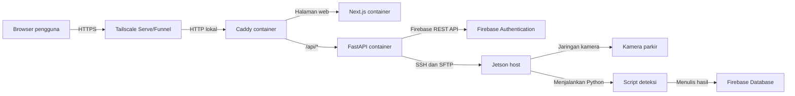
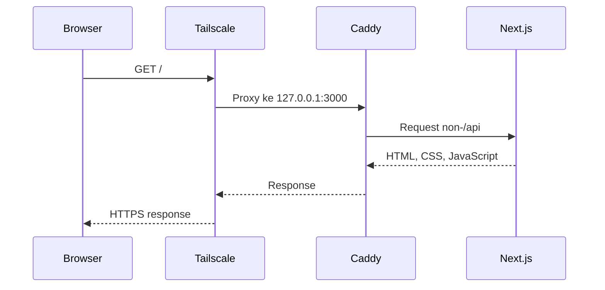
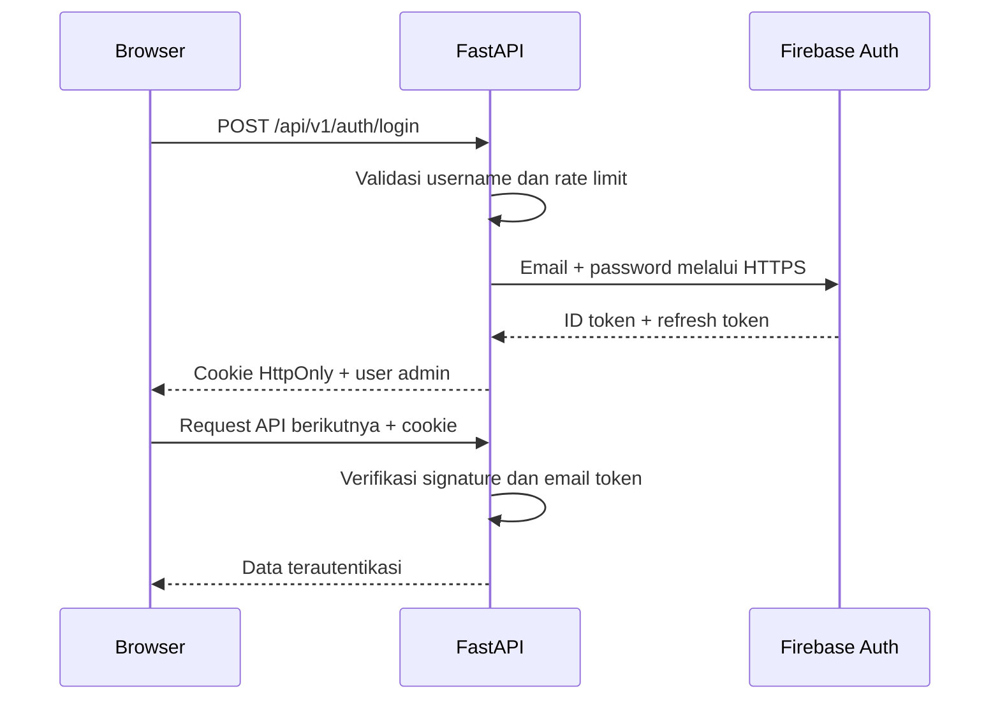
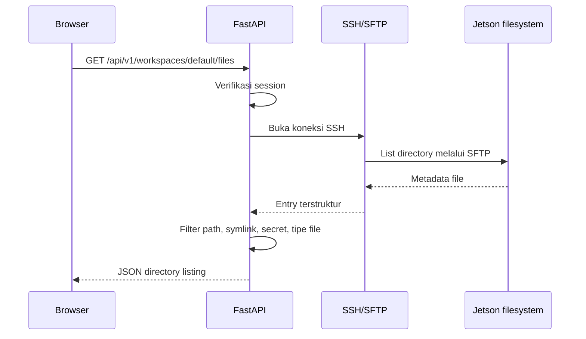
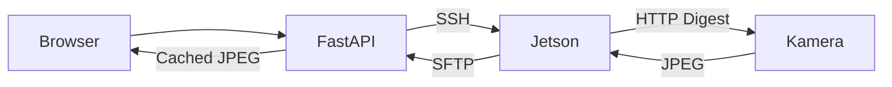
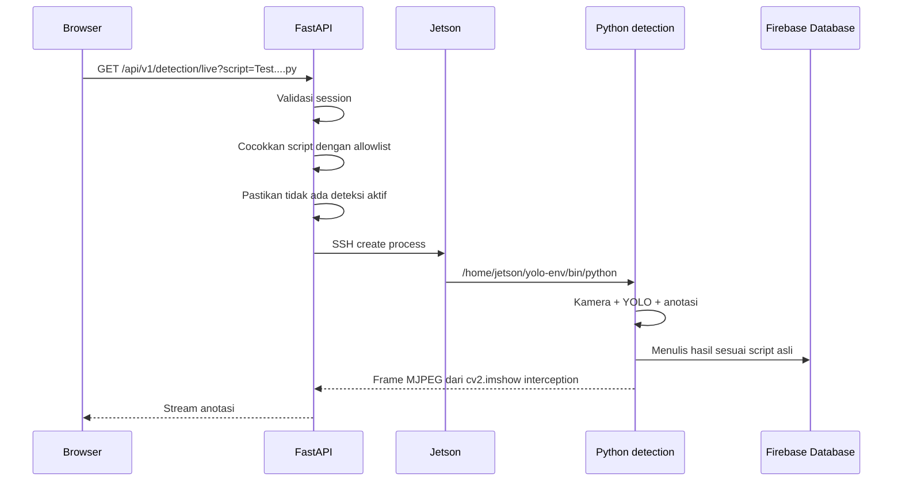
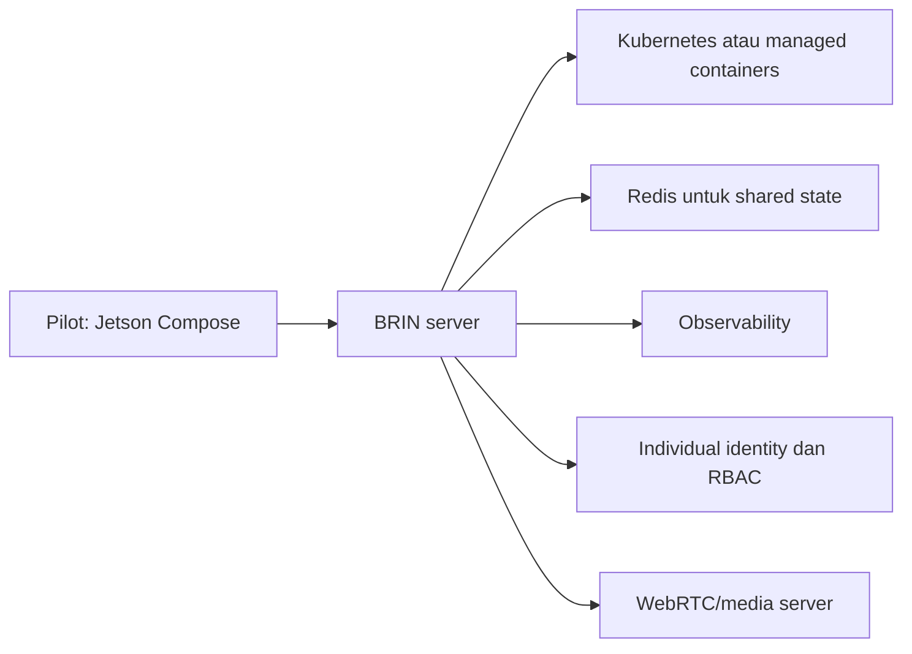

# BRIN Edge Workspace — Arsitektur dan Workflow

> [!abstract] Tujuan belajar
> Setelah membaca catatan ini, kamu seharusnya dapat menjelaskan dari mana request berasal, container mana yang memprosesnya, bagaimana API berkomunikasi dengan Jetson, di mana rahasia disimpan, dan mengapa setiap lapisan diperlukan.

Catatan operasional sehari-hari tersedia di [[02-BRIN-Edge-Workspace-Runbook-Jetson]].

---

## 1. Gambaran paling sederhana

Website ini bukan hanya halaman frontend. Ia adalah sistem kecil yang terdiri dari beberapa lapisan:



Analogi sederhananya:

- **Tailscale** adalah gerbang menuju lokasi.
- **Caddy** adalah resepsionis yang menentukan request harus dikirim ke mana.
- **Next.js** adalah ruang yang dilihat pengguna.
- **FastAPI** adalah petugas yang melakukan pekerjaan sensitif.
- **SSH/SFTP** adalah jalur kerja privat menuju Jetson.
- **Jetson** adalah mesin edge yang dekat dengan kamera dan menjalankan deteksi.
- **Firebase Authentication** memeriksa identitas pengguna.

> [!important]
> Browser tidak pernah menerima SSH key, password kamera, URL RTSP, atau akses shell. Browser hanya berbicara dengan API yang sudah dibatasi.

---

## 2. Mengapa memakai beberapa container?

Project menjalankan tiga service dari `compose.yaml`:

| Service | Fungsi | Port publik |
|---|---|---:|
| `caddy` | Reverse proxy dan satu pintu masuk | `3000` pada host |
| `web` | Next.js frontend | Tidak dipublikasikan |
| `api` | FastAPI, autentikasi, SSH, kamera, deteksi | Tidak dipublikasikan |

Hanya Caddy yang boleh menerima koneksi dari luar Docker. Next.js dan FastAPI hanya tersedia di jaringan internal Docker.

Ini menerapkan konsep cloud **separation of concerns**: setiap service memiliki satu tanggung jawab utama dan dapat diperiksa atau direstart secara terpisah.

### Resource guardrails

`compose.yaml` juga membatasi resource:

- API: maksimum `768 MB`, `1.5 CPU`.
- Web: maksimum `512 MB`, `0.75 CPU`.
- Caddy: maksimum `128 MB`, `0.25 CPU`.
- Jumlah process/PID dibatasi.
- Filesystem container dibuat read-only, kecuali lokasi cache dan `/tmp`.
- Log Docker dirotasi agar disk tidak terus terisi.
- `restart: unless-stopped` membuat service kembali hidup setelah reboot.

Ini adalah contoh praktik **reliability engineering**: kita tidak hanya membuat program berjalan, tetapi juga membatasi dampak ketika program bermasalah.

---

## 3. Struktur repository

```text
SSH-BRIN-Web/
├── compose.yaml               # Mendefinisikan semua container
├── Caddyfile                  # Routing request ke web atau API
├── deploy/
│   ├── jetson.env.example     # Template konfigurasi, aman untuk Git
│   ├── jetson.env             # Konfigurasi asli, privat, tidak di-commit
│   └── README.md              # Panduan deployment Jetson
├── apps/
│   ├── web/
│   │   ├── Dockerfile
│   │   ├── public/            # Logo dan gambar statis
│   │   └── src/
│   │       ├── app/           # Next.js page, layout, CSS, provider
│   │       ├── components/    # Workspace, login, tutorial, icon
│   │       └── lib/           # Client API dan data fallback
│   └── api/
│       ├── Dockerfile
│       ├── app/
│       │   ├── main.py        # Endpoint dan koordinasi API
│       │   ├── auth.py        # Firebase login dan session cookie
│       │   ├── config.py      # Membaca environment variable
│       │   ├── jetson.py      # SSH, SFTP, health, kamera
│       │   ├── detection.py   # Allowlist dan runner deteksi
│       │   └── models.py      # Bentuk data API
│       └── tests/             # Test keamanan dan behavior backend
└── docs/                      # Catatan belajar dan runbook
```

### File yang paling penting

| File | Pertanyaan yang dijawab |
|---|---|
| `compose.yaml` | Service apa saja yang berjalan dan resource apa yang diberikan? |
| `Caddyfile` | Request `/api/*` dan request halaman dikirim ke mana? |
| `deploy/jetson.env` | Di mana konfigurasi privat deployment disimpan? |
| `apps/web/src/components/edge-workspace.tsx` | Bagaimana dashboard dan interaksi UI bekerja? |
| `apps/web/src/lib/jetson-api.ts` | Endpoint API apa yang dipanggil browser? |
| `apps/api/app/main.py` | Endpoint apa yang tersedia dan bagaimana request dikoordinasikan? |
| `apps/api/app/auth.py` | Bagaimana login, cookie, dan refresh session bekerja? |
| `apps/api/app/jetson.py` | Bagaimana backend mengakses host, file, metrik, dan kamera? |
| `apps/api/app/detection.py` | Script apa yang boleh berjalan dan bagaimana frame dikirim? |

---

## 4. Build time dan runtime

Dua konsep ini penting untuk cloud engineer.

### Build time

Saat menjalankan:

```bash
docker compose --env-file deploy/jetson.env build
```

Docker melakukan hal berikut:

1. Membaca setiap `Dockerfile`.
2. Mengunduh base image ARM64.
3. Menginstal dependency.
4. Menjalankan `next build` untuk frontend.
5. Menyusun image API dan web yang immutable.

Image adalah paket aplikasi. Container adalah instance yang sedang berjalan dari image tersebut.

### Runtime

Saat menjalankan:

```bash
docker compose --env-file deploy/jetson.env up -d
```

Docker:

1. Membuat jaringan internal Compose.
2. Mount SSH key dan `known_hosts` ke API sebagai secret read-only.
3. Membuat volume cache.
4. Menjalankan health check API dan web.
5. Menjalankan Caddy setelah dependency sehat.
6. Memublikasikan hanya port Caddy.

> [!tip] Cara mengingat
> **Build** menghasilkan image. **Run/up** menghasilkan container.

---

## 5. Alur request halaman web

Ketika pengguna membuka URL:

```text
https://<hostname>.ts.net
```

alur yang terjadi:



Caddy membaca aturan:

```caddy
@api path /api/*
reverse_proxy @api api:8000
reverse_proxy web:3000
```

Artinya:

- Path yang diawali `/api/` menuju FastAPI.
- Semua path lain menuju Next.js.

Konsep ini disebut **reverse proxy routing**.

---

## 6. Alur login Firebase

Login tidak dilakukan oleh Next.js secara langsung ke Firebase. Browser mengirim username dan password ke endpoint FastAPI pada origin yang sama.



### Mengapa cookie `HttpOnly`?

JavaScript browser tidak dapat membaca cookie tersebut. Ini mengurangi risiko token dicuri oleh script frontend yang tidak semestinya.

Cookie juga menggunakan:

- `SameSite=Strict` untuk mengurangi CSRF.
- `Secure=true` pada deployment HTTPS.
- ID token berumur pendek.
- Refresh token untuk memperbarui session secara otomatis.

### Mengapa username dipetakan ke email?

Firebase Email/Password secara internal membutuhkan email. UI boleh menerima `admin`, tetapi backend memetakannya ke email yang dikonfigurasi pada `FIREBASE_ADMIN_EMAIL`.

> [!warning]
> Satu akun bersama cocok untuk pilot, tetapi bukan desain terbaik untuk production. Akun individual memberi audit dan revocation per pengguna.

---

## 7. Alur membaca file Jetson

Ketika pengguna membuka folder:



Ketika pengguna memilih file:

1. Browser mengirim relative path.
2. Backend menormalisasi path.
3. Backend memastikan path tetap di bawah `JETSON_WORKSPACE`.
4. Symlink dan nama sensitif ditolak.
5. Hanya tipe teks yang diizinkan.
6. Ukuran maksimum diperiksa.
7. Credential yang tertulis di source disamarkan.
8. Konten aman dikirim ke browser.
9. Frontend menampilkan kode dalam mode read-only.

Ini adalah contoh **defense in depth**: bukan hanya satu pemeriksaan, tetapi beberapa lapisan pemeriksaan.

### Mengapa SFTP, bukan `ls`?

SFTP memberikan metadata terstruktur dan menghindari parsing output shell yang rentan salah atau injection.

---

## 8. Mengapa container SSH kembali ke Jetson?

FastAPI berada di container, tetapi workspace, virtual environment deteksi, GPU, dan jaringan kamera berada di host Jetson.

Jalur yang dipakai:

```text
API container
    ↓ host.docker.internal
Docker host gateway
    ↓ port 22
SSH server Jetson
    ↓
Workspace / Python deteksi / jaringan kamera
```

Kelebihannya:

- Kode backend tetap sama ketika nanti dipindahkan ke BRIN server.
- Container tidak perlu mount seluruh filesystem host.
- Akses dibatasi oleh SSH user dan key khusus.
- Host key dipin melalui `known_hosts` untuk mencegah man-in-the-middle.

Kekurangannya:

- Ada overhead SSH walaupun host-nya sama.
- Permission key harus benar.
- SSH daemon harus tetap aktif.

Ini adalah trade-off arsitektur: sedikit overhead ditukar dengan isolation dan portability yang lebih baik.

---

## 9. Alur metrik perangkat

Endpoint `/api/v1/system/health` menjalankan script terbatas pada Jetson untuk membaca:

- `tegrastats` untuk GPU, RAM, dan suhu.
- `/proc/uptime` untuk uptime.
- Disk usage untuk penyimpanan.
- `ping` dari Jetson ke kamera untuk status dan latensi.

Hasil disimpan dalam cache sekitar 30 detik. Jika 20 browser membuka dashboard bersama, backend tidak perlu menjalankan 20 pemeriksaan SSH identik.

Konsep cloud yang digunakan adalah **request coalescing dan caching** untuk melindungi dependency yang lebih lambat.

---

## 10. Alur gambar kamera

Snapshot tidak langsung diambil oleh browser.



Rahasia kamera dibaca oleh script di Jetson dari konfigurasi lokal. Rahasia itu tidak dikirim ke FastAPI sebagai response dan tidak pernah dikirim ke browser.

Snapshot disimpan pada dua lapisan:

- Cache aman di home directory Jetson.
- Docker volume cache untuk API.

Cache membuat halaman tetap cepat ketika kamera membutuhkan waktu merespons.

---

## 11. Alur Real-Time Cam

Real-Time Cam menggunakan MJPEG:

```text
RTSP camera channel 101
  → OpenCV decode pada Jetson
  → JPEG sekitar 4 FPS
  → stdout melalui SSH
  → FastAPI StreamingResponse
  → Caddy tanpa buffering
  → browser 
```

Mengapa `flush_interval -1` digunakan pada Caddy? Agar proxy tidak menunggu buffer penuh sebelum mengirim frame berikutnya.

### Batas concurrency

Default maksimum penonton live adalah `4`. Setiap live viewer membutuhkan pipeline decode dan SSH sendiri. Tanpa batas ini, banyak pengguna dapat menghabiskan CPU, bandwidth, dan memory Jetson.

MJPEG mudah diimplementasikan, tetapi tidak seefisien WebRTC untuk banyak penonton.

---

## 12. Alur deteksi kendaraan

Deteksi berbeda dari file viewer. Browser tidak dapat mengirim command shell atau path bebas.



Wrapper mengganti fungsi jendela OpenCV seperti `cv2.imshow()` agar frame dapat dikirim sebagai MJPEG tanpa desktop GUI. Bagian lain dari script—termasuk Firebase write—tetap berjalan.

### Pengaman utama

- Nama script harus ada di allowlist statis.
- Path harus tetap berada di root workspace.
- Ukuran script diperiksa.
- Python executable sudah ditentukan backend.
- Hanya satu deteksi boleh berjalan.
- Menutup stream menghentikan process remote.

---

## 13. State, cache, dan lock

Sebagian state saat ini berada di memory process FastAPI:

- Deteksi aktif.
- Jumlah live viewer.
- Rate-limit login.
- Cache metrik.
- Cache directory.

Konsekuensinya:

- State hilang ketika API restart.
- Satu API replica bekerja dengan baik.
- Menjalankan beberapa replica tanpa Redis dapat membuat lock berbeda-beda.

> [!note] Pelajaran cloud
> Jika aplikasi nanti membutuhkan horizontal scaling, pindahkan lock, rate limit, dan job state ke service bersama seperti Redis atau database.

---

## 14. Security boundary

### Data yang boleh diterima browser

- Daftar file yang telah difilter.
- Isi file teks yang telah disanitasi.
- Metrik kesehatan.
- JPEG snapshot.
- MJPEG live/detection.

### Data yang tidak boleh diterima browser

- SSH private key.
- Isi `known_hosts` yang sensitif secara operasional.
- Password kamera.
- URL RTSP dengan credential.
- Firebase service account.
- Command shell bebas.
- File model atau credential.

### Lapisan proteksi

1. HTTPS dari browser.
2. Firebase Authentication.
3. HttpOnly session cookie.
4. Rate limit login.
5. Caddy sebagai satu ingress.
6. Container non-root dan read-only.
7. Docker secret mounts.
8. SSH known-host verification.
9. Workspace root restriction.
10. File and script allowlist.
11. Resource limit dan bounded logging.

---

## 15. Apa yang terjadi ketika Jetson reboot?

1. Docker service aktif karena systemd.
2. Container hidup kembali karena `restart: unless-stopped`.
3. API dan web menjalankan health check.
4. Caddy menunggu dependency sehat.
5. Tailscale daemon aktif kembali.
6. Konfigurasi Serve/Funnel biasanya tetap tersimpan.
7. Cache memory kosong dan akan diisi lagi.
8. Session browser tetap dapat diperbarui selama Firebase refresh token masih valid.

---

## 16. Hubungan project ini dengan pekerjaan cloud engineer

| Praktik project | Konsep cloud engineer |
|---|---|
| Dockerfile | Image engineering |
| Compose | Infrastructure as Code skala satu host |
| Caddy | Ingress/reverse proxy |
| Tailscale | Private overlay network / zero-trust networking |
| Firebase Auth | Managed identity provider |
| Environment variables | Configuration management |
| Docker secrets | Secret handling |
| Health check | Service reliability |
| Restart policy | Self-healing dasar |
| Cache dan lock | Performance dan concurrency control |
| CPU/memory limit | Resource governance |
| Log rotation | Operational hygiene |
| SSH host-key pinning | Supply-chain/network trust |
| Tests dan audit | CI/CD quality gate |

### Evolusi berikutnya menuju production



Kubernetes bukan langkah pertama yang wajib. Seorang cloud engineer harus memilih kompleksitas sesuai kebutuhan, bukan memakai tool terbesar untuk semua masalah.

---

## 17. Cara menelusuri masalah seperti engineer

Gunakan urutan dari luar ke dalam:

```text
Browser
→ DNS/HTTPS/Tailscale
→ Caddy
→ Web atau API
→ Authentication
→ SSH
→ Jetson workspace/camera/detection
```

Contoh: UI menampilkan “Jetson tidak terhubung”.

- Login berhasil berarti browser, HTTPS, Caddy, API, dan Firebase sudah bekerja.
- `/api/v1/health` berhasil berarti process FastAPI hidup.
- File dan metrik gagal berarti fokus diagnosis bergeser ke SSH, key, host key, atau workspace.

Ini disebut **fault isolation**: jangan menebak seluruh sistem sekaligus; cari lapisan terakhir yang masih berhasil.

---

## 18. Pertanyaan latihan

1. Mengapa FastAPI tidak boleh diekspos langsung pada port `8000`?
2. Apa perbedaan Docker image dan container?
3. Mengapa password kamera tidak ditempatkan pada frontend?
4. Mengapa SFTP lebih aman daripada parsing command `ls`?
5. Apa yang terjadi jika API dijalankan menjadi tiga replica sekarang?
6. Mengapa MJPEG dibatasi empat penonton?
7. Apa keuntungan memindahkan frontend/API ke BRIN server sementara deteksi tetap di Jetson?
8. Layer mana yang harus diperiksa jika login berhasil tetapi file tree hanya berisi data contoh?

> [!success] Jawaban inti
> Project ini adalah contoh edge-cloud hybrid: user-facing service dikelola seperti cloud workload, tetapi compute yang dekat dengan kamera tetap berjalan pada edge device.

---

## 19. Glosarium

| Istilah | Arti |
|---|---|
| Edge computing | Pemrosesan dekat dengan sumber data seperti kamera |
| Reverse proxy | Service yang menerima request lalu meneruskannya ke service internal |
| Container | Process terisolasi yang dibuat dari image |
| Image | Paket immutable berisi aplikasi dan dependency |
| SFTP | Protokol transfer/list file di atas SSH |
| Tailnet | Jaringan privat milik organisasi pada Tailscale |
| Funnel | Publikasi service Tailnet ke internet |
| Serve | Publikasi HTTPS hanya untuk anggota Tailnet |
| HttpOnly | Cookie yang tidak dapat dibaca JavaScript browser |
| MJPEG | Stream berupa rangkaian gambar JPEG |
| Allowlist | Daftar eksplisit item yang boleh digunakan |
| Health check | Pemeriksaan otomatis apakah service masih responsif |
| Horizontal scaling | Menambah jumlah instance service |
| Observability | Logs, metrics, traces, dan alert untuk memahami sistem |

---

## Lanjutkan

Untuk mengoperasikan deployment sehari-hari, buka [[02-BRIN-Edge-Workspace-Runbook-Jetson]].
